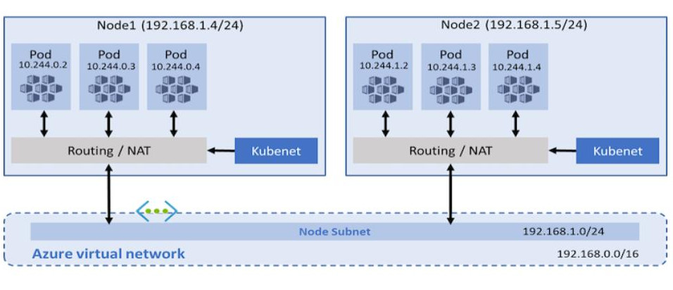

# Deploying Hyperledger Besu with Kubernetes

Use the [reference implementations](https://github.com/ConsenSys/besu-kubernetes) to install
private networks using Kubernetes(K8s). Reference implementations are available using:

* [Helm](https://github.com/ConsenSys/quorum-kubernetes/tree/master/dev)
* [Helmfile](https://github.com/roboll/helmfile)
* [`kubectl`](https://github.com/ConsenSys/besu-kubernetes/tree/master/playground/kubectl).

Familiarize yourself with the reference implementations and customize them for your requirements.

## Quorum-Kubernetes

[Quorum-Kubernetes](https://github.com/ConsenSys/quorum-Kubernetes) is a repository containing Kubernetes manifests and
Helm charts that you can customize and deploy on a local cluster or in the cloud.

!!! important

    We recommend starting with the [playground](https://github.com/ConsenSys/quorum-kubernetes/tree/master/playground)
    directory and working through the example setups before moving to the
    [`dev`](https://github.com/ConsenSys/quorum-kubernetes/tree/master/dev) directory, and finally to the
    [`prod`](https://github.com/ConsenSys/quorum-kubernetes/tree/master/prod) directory.

The `dev` and `prod` directories are identical in terms of what gets deployed, but differ in that the `prod` folder uses
best practices to manage identity (Managed Identities in Azure and IAM in AWS), vaults (KeyVault in Azure and Secrets
Manager in AWS), and CSI drivers.

All setups use monitoring and we recommend deploying the monitoring manifests or charts to get an overview of the
network, nodes, and volumes, and you can create alerts accordingly.
In addition, there's an example configuration for ingress and routes that you can customize to suit your requirements.

### Cloud Support

The repository's `dev` charts support on premise and cloud providers like AWS, Azure, GCP, IBM etc. The `prod` charts
currently only supports AWS EKS and Azure AKS natively. You can configure the provider in
the [values.yml](https://github.com/ConsenSys/quorum-kubernetes/blob/master/dev/helm/values/genesis-goquorum.yml)
file by setting `provider` to `local`, `aws`, or `azure`.
You can also pass in extra configuration such as a KeyVault name (Azure only).

The repository also contains [Azure ARM templates](https://github.com/ConsenSys/quorum-kubernetes/tree/master/azure) and
[AWS `eksctl` templates](https://github.com/ConsenSys/quorum-kubernetes/tree/master/aws) to deploy the required base infrastructure.

## Limitations

When using multi-clusters, Kubernetes load balancers disallow TCP and UDP traffic on the same port, which inhibits
discovery working natively for each pod.
Use the following solutions to mitigate this limitation:

* Disallow discovery and use static nodes to allow only TCP traffic.
  This isn't an issue for load balancers or exposing nodes publicly.
* If you need to use discovery, use something such as [CNI](#CNI) which is supported by all major cloud providers, and
  the cloud templates already have CNI implemented.

### CNI

With the traditional `kubenet` networking mode, nodes get an IP from the virtual network subnet.
Each node in turn uses NAT to configure the pods so that they reach other pods on the virtual network.
This limits where they can reach but also more specifically what can reach them.
For example, an external VM which must have custom routes does not scale well.

CNI, on the other hand, allows every pod to get a unique IP directly from the virtual subnet which removes this restriction.
Therefore, it has a limit on the maximum number of pods that can be spun up, so you must plan ahead to avoid IP exhaustion.

## Multi-Cluster

You must enable [CNI](#cni) to use multi-cluster, or to connect external nodes to an existing Kubernetes cluster.
To connect multiple clusters, they must each have different CIDR blocks to ensure no conflicts, and the first step is to
peer the VPCs or VNets together and update the route tables.
From that point on you can use static nodes and pods to communicate across the cluster.

The same setup also works to connect external nodes and business applications from other infrastructure, either in the
cloud or on premise.

## Concepts

### Storage

Where possible we recommend you use [Storage Classes](https://kubernetes.io/docs/concepts/storage/storage-classes/) and
[Persistent Volume Claims](https://kubernetes.io/docs/concepts/storage/persistent-volumes/#persistentvolumeclaims). In
particular when using persistent volume claims ensure that you set the `allowVolumeExpansion` to `true`. This will help
to keep costs low and it is much easier to grow a volume rather than creating new volumes and copying data across

### [Namespaces](https://kubernetes.io/docs/concepts/overview/working-with-objects/namespaces/)

In Kubernetes, namespaces provides a mechanism for isolating groups of resources within a single cluster. Both
namespaces and resources (for example StatefulSets, Services, etc) within a namespaces need to be unique, but not
resources across namespaces.

!!!note
    Namespace-based scoping is not applicable for cluster-wide objects (e.g. StorageClass, PersistentVolumes, etc).